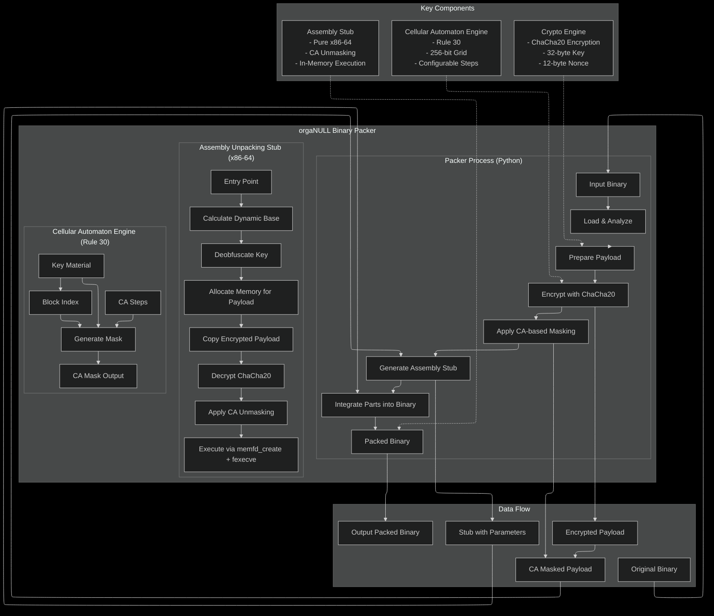

<div align="center">
  <h1>orgaNULL</h1>
  <p><b>CELLULAR AUTOMATON BINARY OBFUSCATOR</b></p>
  
  
</div>

<div align="center">
  
  
  &nbsp;
  
  &nbsp;
  
  &nbsp;
  
  
</div>

<p align="center">
  <a href="#overview">Overview</a> •
  <a href="#features">Features</a> •
  <a href="#usage">Usage</a> •
  <a href="#architecture">Architecture</a> •
  <a href="#obfuscation-layers">Obfuscation</a> •
  <a href="#testing">Testing</a> •
  <a href="#contributing">Contributing</a>
</p>

<hr>

<br>

## 🎯 OVERVIEW

**OrgaNULL** is an advanced binary packer that leverages cellular automaton-based obfuscation combined with modern cryptographic techniques to create heavily protected executables.

### 📄 THE PIPELINE

---

<div align="center">
  
</div>

---

**OrgaNULL**:

1. **LOADS** the target binary and extracts its payload
2. **ENCRYPTS** using ChaCha20 stream cipher with 256-bit keys
3. **OBFUSCATES** with Cellular Automaton (Rule 30) masking
4. **EMBEDS** pure x86-64 assembly unpacking stub
5. **OUTPUTS** a heavily obfuscated, ready-to-execute binary

The core of `OrgaNULL` is a dual-layer protection system combining cryptographic strength with algorithmic complexity, making analysis exceptionally difficult.

<br>

## 🚀 INSTALLATION AND USAGE

### PREREQUISITES

- Python 3.7 or higher
- GCC toolchain for assembly compilation
- Linux system with `memfd_create` and `fexecve` support
- LIEF library for binary manipulation
- Cryptography library for ChaCha20

### 🔨 INSTALLATION

Install Python dependencies:

```bash
pip install -r requirements.txt
```

### 📝 BASIC USAGE

**1. PACK A BINARY**

```bash
python3 organull/organull.py <input_binary> <output_packed_binary>
```

**2. EXECUTE THE PACKED BINARY**

```bash
./<output_packed_binary>
```

The unpacking stub automatically decrypts and executes the original binary in memory.

### 🔧 ADVANCED OPTIONS

**CUSTOM CA EVOLUTION STEPS:**

```bash
python3 organull/organull.py <input_binary> <output_packed_binary> --ca-steps 200
```

**ENABLE DEBUG STUB:**

```bash
python3 organull/organull.py <input_binary> <output_packed_binary> --debug-stub
```

**PARAMETERS:**
- `--ca-steps N` - Number of cellular automaton evolution steps (default: 100)
- `--debug-stub` - Compile unpacking stub with debug messages

**EXAMPLE:**

```bash
python3 organull/organull.py ./my_binary ./my_binary_packed --ca-steps 200 --debug-stub
```

### 🐍 PYTHON API

`OrgaNULL` can be used as a library:

```python
from organull import pack_binary

# Pack a binary with default settings
pack_binary("input_binary", "packed_binary")

# Pack with custom settings
pack_binary("input_binary", "packed_binary", debug_stub=True)
```

<br>

## ⚡ FEATURES

<table>
<tr>
<td width="50%">

### CORE CAPABILITIES

- ✅ **Dual-layer obfuscation** combining crypto + CA
- 🔐 **ChaCha20 encryption** with 256-bit keys
- 🧬 **Cellular Automaton masking** using Rule 30
- 💾 **In-memory execution** via memfd_create/fexecve
- 🛡️ **Anti-debugging protection** with ptrace checks
- 🎯 **Position Independent Code** for ASLR compatibility
- ⚙️ **Pure assembly unpacking** for maximum efficiency

</td>
<td width="50%">

### PROTECTION FEATURES

- **Multi-format support**: ELF and PE binaries
- **Dynamic obfuscation**: Unique CA masks per block
- **Anti-analysis**: Assembly-based unpacking complexity
- **No disk artifacts**: Direct memory execution
- **ASLR compatible**: Dynamic base address calculation
- **Configurable intensity**: Adjustable CA evolution steps

</td>
</tr>
</table>

<br>

## 🗂️ MODULAR ARCHITECTURE

`OrgaNULL` features a clean separation between high-level logic and low-level operations:

### 📦 CORE COMPONENTS

| Component | File | Purpose |
|-----------|------|---------|
| **Main Packer** | `organull/organull.py` | CLI interface & orchestration |
| **CA Engine** | `organull/ca_engine.py` | Rule 30 cellular automaton implementation |
| **Crypto Engine** | `organull/crypto_engine.py` | ChaCha20 encryption/decryption |
| **Unpacking Stub** | `organull/complete_unpacking_stub.s` | Pure x86-64 assembly unpacker |
| **Stub Compiler** | `organull/compile_complete_unpacking_stub.py` | Assembly compilation script |
| **API Interface** | `organull/__init__.py` | Package exports and public API |

### 🎨 ARCHITECTURE BENEFITS

<table>
<tr>
<td>🔧 <b>Maintainability</b></td>
<td>Clear separation between Python and assembly</td>
</tr>
<tr>
<td>📈 <b>Extensibility</b></td>
<td>Easy to add new obfuscation layers</td>
</tr>
<tr>
<td>✅ <b>Testability</b></td>
<td>Comprehensive test suite included</td>
</tr>
<tr>
<td>🚀 <b>Performance</b></td>
<td>Assembly stub for critical path</td>
</tr>
<tr>
<td>🛡️ <b>Security</b></td>
<td>Multiple protection layers</td>
</tr>
</table>

<br>

## 🎯 OBFUSCATION LAYERS

`OrgaNULL` employs a sophisticated multi-layer protection system:

### LAYER 1: CHACHA20 ENCRYPTION

<details>
<summary><b>Click to expand encryption details</b></summary>

- **256-bit encryption keys** for maximum security
- **96-bit nonces** for unique encryption per block
- **Stream cipher design** for efficient encryption
- **Zero-padding** for proper block alignment
- **Modern cryptographic standard** with proven security

</details>

### LAYER 2: CELLULAR AUTOMATON MASKING

<details>
<summary><b>Click to expand CA details</b></summary>

- **Rule 30 implementation** - Chaotic, pseudo-random evolution
- **Unique masks per block** - Block index XORed with key material
- **Configurable evolution steps** - Adjustable complexity (default: 100)
- **32-byte block processing** - Optimal for performance
- **Deterministic yet complex** - Reproducible but hard to analyze

</details>

### LAYER 3: ASSEMBLY UNPACKING

<details>
<summary><b>Click to expand assembly features</b></summary>

- **Pure x86-64 assembly** - No high-level language overhead
- **CA evolution in assembly** - Direct algorithm implementation
- **ChaCha20 decryption in assembly** - Native crypto operations
- **Dynamic base address calculation** - ASLR compatibility
- **Anti-debugging checks** - Ptrace-based detection
- **In-memory execution** - memfd_create + fexecve syscalls

</details>

### ADVANCED PROTECTION TECHNIQUES

<details>
<summary><b>Click to expand advanced techniques</b></summary>

#### 🛡️ ANTI-ANALYSIS
- **Ptrace-based anti-debugging** - Prevents debugger attachment
- **In-memory execution** - No disk artifacts for forensics
- **Assembly complexity** - Difficult to analyze and reverse

#### 🔄 POSITION INDEPENDENCE
- **ASLR compatibility** - Works with randomized addresses
- **Dynamic base calculation** - Runtime address resolution
- **Relative addressing** - Position-independent code

#### 🎭 OBFUSCATION DEPTH
- **Dual-layer encryption** - Crypto + CA masking
- **Configurable complexity** - Adjustable CA evolution steps
- **Unique per-block masks** - No pattern repetition

</details>

<br>

## ✅ TESTING

### COMPREHENSIVE TEST SUITE

Run all tests:

```bash
# Main integration test
python3 tests/run_packer_test.py

# Unit tests
python3 tests/test_ca_engine.py
python3 tests/test_crypto_engine.py

# All tests
python -m unittest discover tests/
```

### TEST COVERAGE

- ✓ CA engine correctness
- ✓ Crypto engine functionality
- ✓ Assembly stub compilation
- ✓ End-to-end packing/unpacking
- ✓ Binary format compatibility

<br>

## 🔬 TECHNICAL IMPLEMENTATION

The obfuscation process is sophisticated yet systematic:

### 1️⃣ BINARY ANALYSIS
The input binary is loaded and analyzed using LIEF. The payload is extracted while preserving necessary metadata.

### 2️⃣ ENCRYPTION LAYER
ChaCha20 stream cipher encrypts the entire payload using a randomly generated 256-bit key and 96-bit nonce.

### 3️⃣ CA MASKING LAYER
Each 32-byte block of encrypted data is masked with a unique pattern generated by evolving a Rule 30 cellular automaton.

### 4️⃣ STUB COMPILATION
The assembly unpacking stub is compiled with embedded configuration parameters (key, nonce, CA steps, payload size).

### 5️⃣ BINARY INTEGRATION
The encrypted and masked payload is embedded into a new binary along with the compiled stub. The entry point is adjusted to execute the stub first.

### 6️⃣ RUNTIME UNPACKING
When executed, the stub:
- Performs anti-debugging checks
- Regenerates CA masks and removes them
- Decrypts the payload with ChaCha20
- Creates an in-memory file descriptor
- Executes the original binary from memory

<br>

## ⚠️ LIMITATIONS AND SECURITY CONSIDERATIONS

`OrgaNULL` is a powerful research tool with important considerations:

### STRENGTHS

- ✅ Strong cryptographic foundation (ChaCha20)
- ✅ Additional CA-based obfuscation layer
- ✅ Assembly unpacking increases analysis difficulty
- ✅ In-memory execution avoids disk artifacts
- ✅ Anti-debugging protections

### LIMITATIONS

- ⚠️ x86-64 Linux systems only
- ⚠️ Not suitable for production security applications
- ⚠️ Assembly complexity may cause compatibility issues
- ⚠️ Significant increase in packed binary size
- ⚠️ Requires memfd_create and fexecve support

### FUTURE ROADMAP

- 🔄 Multi-architecture support (ARM, x86)
- 📚 Additional obfuscation techniques
- 🎯 Enhanced anti-analysis features
- ⚡ Optimized stub size and performance
- 🧪 Extended compatibility testing

<br>

## CONTRIBUTING

Contributions are welcome!

<br>

## 📄 LICENSE

`OrgaNULL` / `𝑶𝒓𝒈𝒂𝑵𝑼𝑳𝑳` is available in the **public domain**. See [UNLICENSE.md](./UNLICENSE.md) for details.

<br>

<div align="center">
  <hr>
  <p><i>boredom, compounds, a restless mind</i></p>
  <p><b>orgaNULL</b> - f*ck the Hayflick Limit</p>
</div>